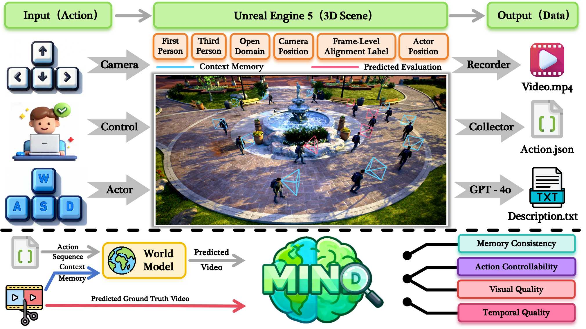
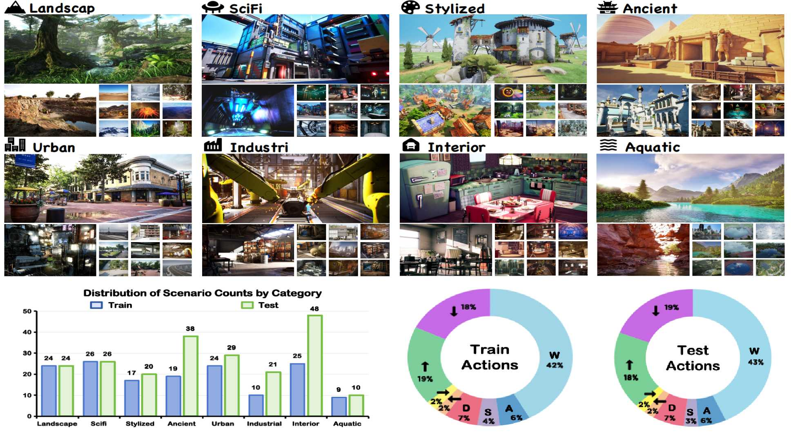

<p align="center">
  
</p>
<h2 align="center"><span style="color:#1F82C0">M</span><span style="color:#1CBF91">I</span><span style="color:#39C46E">N</span><span style="color:#149C7E">D</span>: Benchmarking Memory Consistency and Action Control in World Models</h2>
<h5 align="center"><span style="color:red">TL;DR:</span> The first open-domain closed-loop revisited benchmark for evaluating memory consistency and action control in world models</h5>
<div align="center">

🌐[Homepage](https://csu-jpg.github.io/MIND.github.io/) | 👉 [Dataset](https://csu-jpg.github.io/MIND.github.io/) | 📄 [Paper](https://csu-jpg.github.io/MIND.github.io/) | 🏆 [Leaderboard (coming soon)](https://csu-jpg.github.io/MIND.github.io/)

</div>

## 📢 Updates

- **[2026-2-9]**: **MIND** is online 🎉 🎉 🎉

## 📝 TODO
- [ ] Open-source **MIND-World (1.3B)** all training and inference code including a detailed code tutorial
- [ ] Release the weights of all stages for **MIND-World (1.3B)** including frame-wised student model
- [ ] Building Leaderboard
- [ ] Building repo Awesome—Interactive World Model

## 📑 Table of Contents
- [📜 Abstract](#-abstract)
- [🌟 Project Overview](#-project-overview)
- [📊 Dataset Overview](#-dataset-overview)
- [🚀 Setup](#-setup)
- [🗂 Dataset Format](#-dataset-format)
- [🏆 LeaderBoard (Coming soon)](#--leaderboard)
- [🎓 BibTex](#-bibtex)
- [📧 Contact](#-contact)
- [🙏 Acknowledgements](#-acknowledgements])
## 📜 Abstract
​	World models aim to understand, remember, and predict dynamic visual environments, yet a unified benchmark for evaluating their fundamental abilities remains lacking. To address this gap, we introduce **<span style="color:#1F82C0">M</span><span style="color:#1CBF91">I</span><span style="color:#39C46E">N</span><span style="color:#149C7E">D</span>**, the first open-domain closed-loop revisited benchmark for evaluating **<span style="color:#1F82C0">M</span>**emory cons**<span style="color:#1CBF91">I</span>**stency and action co**<span style="color:#39C46E">N</span>**trol in worl**<span style="color:#149C7E">D</span>** models. **<span style="color:#1F82C0">M</span><span style="color:#1CBF91">I</span><span style="color:#39C46E">N</span><span style="color:#149C7E">D</span>** contains 250 high-quality videos at 1080p and 24 FPS, including 100 (first-person) + 100 (third-person) video clips under a shared action space and 25 + 25 clips across varied action spaces covering eight diverse scenes. We design an efficient evaluation framework to measure two core abilities: memory consistency and action control, capturing temporal stability and contextual coherence across viewpoints. Furthermore, we design various action spaces, including different character movement speeds and camera rotation angles, to evaluate the action generalization capability across different action spaces under shared scenes. To facilitate future performance benchmarking on **<span style="color:#1F82C0">M</span><span style="color:#1CBF91">I</span><span style="color:#39C46E">N</span><span style="color:#149C7E">D</span>**, we introduce **MIND-World**, a novel interactive Video-to-World baseline. Extensive experiments demonstrate the completeness of **<span style="color:#1F82C0">M</span><span style="color:#1CBF91">I</span><span style="color:#39C46E">N</span><span style="color:#149C7E">D</span>** and reveal key challenges in current world models, including the difficulty of maintaining long-term memory consistency and generalizing across action spaces.

## 🌟 Project Overview

<p align="center">

</p>

<b>Fig 1. Overview of the <span style="color:#1F82C0">M</span><span style="color:#1CBF91">I</span><span style="color:#39C46E">N</span><span style="color:#149C7E">D</span>. We build and collect the first open-domain benchmark using Unreal Engine 5, supporting both first-person and third-person perspectives with 1080p resolution at 24 FPS.</b>

## 📊 Dataset Overview
<p align="center">

</p><b>Fig 2. Distribution for Scene Categories and Action Space in <span style="color:#1F82C0">M</span><span style="color:#1CBF91">I</span><span style="color:#39C46E">N</span><span style="color:#149C7E">D</span> Dataset. <span style="color:#1F82C0">M</span><span style="color:#1CBF91">I</span><span style="color:#39C46E">N</span><span style="color:#149C7E">D</span> supports open-domain scenarios with diverse and well-balanced action spaces.</b></p>

## 🚀 Setup

##### 1. Environment setup

- Follow [ViPE's](https://github.com/nv-tlabs/vipe) instruction to build conda envrionment, until ```ViPE``` command is avilable

- install our requirements under the same conda env (in the same above env.):

```bash
pip install -r requirements.txt 
```
##### 2. Command Line Arguments

- `--gt_root`: Ground truth data root directory (required)
- `--test_root`: Test data root directory (required)
- `--dino_path`: DINOv3 model weights directory (default: `./dinov3_vitb16`)
- `--num_gpus`: Number of GPUs to use for parallel processing (default: 1)
- `--video_max_time`: Maximum video frames to process (default: `None` = use all frames)
- `--output`: Output JSON file path (default: `result_{test_root}_{timestamp}.json`)
- `--metrics`: Comma-separated metrics to compute (default: `lcm,visual,dino,action`)
##### 3. Multi-GPU Support

The metrics computation supports multi-GPU parallel processing for faster evaluation.

```bash
python src/process.py --gt_root /path/to/MIND-Data --test_root /path/to/test/videos --num_gpus 8 --metrics lcm,visual,action
```
**How Multi-GPU Works**
- Videos are put into a task queue.
- Each GPU process take one task from the queue when vacant.
- If failed, the task will be put back into the queue.
- Progress bars show accumulation for all results.
- Every time when a task is finished, the result file is updated. You can obtain intermediate results from the file.
##### 4. How to order your test files
```
{model_name}
├── 1st_data
│   ├── action_space_test
│   │   ├── {corresponding data name}
│   │   │   └── video.mp4
|   |   ...
|   |    
│   └── mem_test
│       ├── {corresponding data name}
│       │   └── video.mp4
|       ...
|
├── 3rd_data
│   ├── action_space_test
│   │   ├── {corresponding data name}
│   │   │   └── video.mp4
|   |   ...
|   |    
│   └── mem_test
│       ├── {corresponding data name}
│       │   └── video.mp4
|       ...
```
- `{model_name}`: custom your model name

- `{corresponding data name}`: corresponding ground truth data file name

#####  5. The detailed information of output **<span style="color:red">`Result.json`</span>**
## 🗂 Dataset Format

#### <span style="color:#1F82C0">M</span><span style="color:#1CBF91">I</span><span style="color:#39C46E">N</span><span style="color:#149C7E">D</span> is available [here](https://huggingface.co/datasets) ! ! ! 

##### 1. The structure of **<span style="color:#1F82C0">M</span><span style="color:#1CBF91">I</span><span style="color:#39C46E">N</span><span style="color:#149C7E">D</span>** ground truth videos **(both for training and for testing)**

```bash
MIND-Data
├── 1st_data
│   ├── test
│   │   ├── action_space_test
│   │   │   ├── data-1
│   │   │   │   ├── action.json
│   │   │   │   └── video.mp4
|   |   |   ...
|   |   |    
│   │   └── mem_test
│   │       ├── data-26
│   │       │   ├── action.json
│   │       │   └── video.mp4
|   |       ...
|   └── train
|       ├── data-76
|       │   ├── action.json
|       │   └── video.mp4
|       ...
|
├── 3rd_data
│   ├── test
│   │   ├── action_space_test
│   │   │   ├── data-126
│   │   │   │   ├── action.json
│   │   │   │   └── video.mp4
|   |   |   ...
|   |   |    
│   │   └── mem_test
│   │       ├── data-151
│   │       │   ├── action.json
│   │       │   └── video.mp4
|   |       ...
|   └── train
|       ├── data-251
|       │   ├── action.json
|       │   └── video.mp4
|       ...
```
##### 2. The detailed information of <span style="color:red">`Action.json`</span>

```
{
    "mark_time": [int] the divider of memory context and expected perdiction; the start frame index of the expected prediction
    "total_time": [int] the total frames of the ground truth video
    "caption" : [text] the text description of the ground truth video
    "data": [
        {
            "time": [int] frame index
            "ws": [int] 0: move forward, 1: move backward
            "ad": [int] 0: move left, 1: move right
            "ud": [int] 0: look up, 1: look down
            "lr": [int] 0: look left, 1: look right
            "actor_pos": {
                "x": [float] the x-coordinate of the character
                "y": [float] the y-coordinate of the character
                "z": [float] the z-coordinate of the character
            },
            "actor_rpy": {
                "x": [float] the roll angle of the character (Euler angles)
                "y": [float] the pitch angle of the character
                "z": [float] the yaw angle of the character
            },
            "camera_pos": {
            		# only exists in 3rd-person mode
                "x": [float] the x-coordinate of the camera 
                "y": [float] the y-coordinate of the camera
                "z": [float] the z-coordinate of the camera
            },
            "camera_rpy": {
           			# only exists in 3rd-person mode
                "x": [float] the roll angle of the camera (Euler angles)
                "y": [float] the pitch angle of the camera
                "z": [float] the yaw angle of the camera
            }
        },
        ...
    ]
}
```
## 🏆  LeaderBoard
The leaderboard is coming...
## 🎓 BibTex

If you find our work can be helpful, we would appreciate your citation and star:

```bibtex
@misc{ye2026mind,
      title={MIND: Benchmarking Memory Consistency and Action Control in World Models}, 
      author={Yixuan Ye, Xuanyu Lu, Yuxin Jiang, Yuchao Gu, Rui Zhao, Qiwei Liang, Jiachun Pan, Fengda Zhang, Weijia Wu, Alex Jinpeng Wang},
      year={2026},
      eprint={xxx},
      archivePrefix={arXiv},
      primaryClass={cs.CV},
      url={https://arxiv.org/abs/xxx}, 
}
```
## 📧 Contact
Please send emails to **yixuanye12@gmail.com** if there is any question

## 🙏 Acknowledgements
We would like to thank [ViPE](https://github.com/nv-tlabs/vipe) and [SkyReels-V2](https://github.com/SkyworkAI/SkyReels-V2) for their great work.